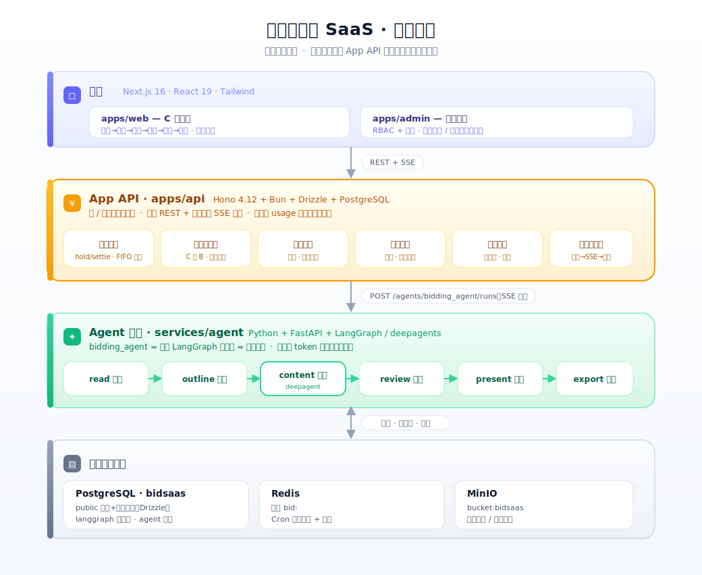

# 投标智能体 SaaS（monorepo）

面向投标场景的 C 端智能体 SaaS：上传招标文件 → 读标 → 提纲 → 正文生成 → 废标风险审查 → 述标 PPT → 导出。
Bun workspaces 单仓多包，**钱与鉴权严格隔离在 App API 一层**，智能体服务对钱无感知。

## 总体架构



三层各持独立职责：前端只渲染、App API 独占钱与身份、智能体只跑工作流并上报用量。**铁律：钱只在 App API 动。**

## 核心功能模块

**C 端应用（`apps/web`）**
- 投标全流程工具区（路由组 `app/(tool)/*` 共享外壳）：上传 / 读标 / 提纲 / 正文 / 审查 / 述标 / 导出 / 项目 / 素材库
- 会员中心：订阅总览 + 积分余额 + 套餐（渐进式当前档/下一档）+ 积分流水/订单分页 + 扫码充值/续费

**App API（`apps/api`）· 钱的唯一权威**
- **积分账本**：余额 = append-only `credit_transactions` 之和；AI 操作两段扣费 `hold → settle/release`；多来源积分 FIFO 按 `expire_at` 过期；全链路幂等键
- **收钱吧支付**：C 扫 B（`/upay/v2/precreate` 返 `qr_code`）+ RSA 回调验签 + 结果轮询；服务端定价快照，不信客户端金额
- **订阅续费**：手动扫码单笔续费（无自动代扣）+ 到期提醒（T-7/3/1）+ past_due 宽限
- **对账 / 退款 / 过期**：账单 vs 订单对账、部分退款+扣回积分、积分过期 Cron；差异转运营后台人工核对
- **推荐奖励引擎**：规则全配置化、两段发放（立即/首付延迟解锁）、双方额度、封顶、防刷冻结
- **智能体编排**：按步预扣→建 run→SSE 中继→存结果→结算；`agent_type` 路由到对应智能体

**智能体服务（`services/agent`）**
- `bidding_agent`：LangGraph 六节点流水线（读标→提纲→正文→审查→述标→导出），Pydantic 输出 schema 与前端字段对齐
- 框架层：模型网关 / 结构化输出 / HITL / 韧性重试 / 上下文压缩；只上报 token usage

**运营后台（`apps/admin`）** — 建设中（spec309/310）：RBAC + 审计 + 对账差异工作台 + 退款 + 充值包/定价配置

## 结构

```
apps/web        C 端前端（Next.js 16 / React 19 / Tailwind v4 / shadcn）
apps/admin      运营后台（Next.js，:3001）
apps/api        App API（Hono + Bun + Drizzle，PostgreSQL public schema）
services/agent  智能体服务（Python 3.12 + uv + FastAPI + LangGraph）
packages/shared 跨端共享类型/契约
docs/           架构方案（docs/superpowers/specs）+ 分阶段实现计划（plans/phase-0..3）
```

## 开发

```bash
bun install
bun run web        # C 端，:3000
bun run admin      # 运营后台，:3001
bun run api        # App API，:8080
bun run typecheck  # 全包类型检查
bun run format     # prettier
```

App API 集成测试连远程真实 PG/Redis/MinIO，**在 mbp 上经 SSH 隧道跑**（本机直连丢包）：

```bash
./test-on-mbp.sh                                   # 全量
./test-on-mbp.sh test/services/membership.test.ts  # 单文件
```

智能体服务：`cd services/agent && uv run pytest`（单测 `uv run pytest tests/path::test_name -q`）。

## 进度

- **Phase 0–2**：账号鉴权 + App 骨架、智能体服务（`services/agent` 的 `bidding_agent` 全流水线）已实现。
- **Phase 3 商业化**：积分账本、收钱吧 C 扫 B 支付（真实 1 分钱冒烟已过）、到期提醒+手动续费、对账/退款/过期、推荐奖励引擎、C 端会员中心均已合并 `main`；运营后台（`apps/admin`，spec309/310）待建。

## 约定（铁律）

- **钱只在 App API 动**：所有积分/支付变更走 `apps/api`；智能体服务只上报用量；每笔扣减/回调带幂等键；余额 = append-only `credit_transactions` 之和。
- 金额全链路整数分，禁浮点存储；多来源积分 FIFO 按 `expire_at` 过期。
- `agent_type` / 智能体包名用直白 snake_case（投标 = `bidding_agent`）。

架构细节见 `docs/superpowers/specs/2026-06-24-bid-assistant-saas-architecture.md`（数据模型 §5、计费/支付 §6、部署 §13-14）；中间件连接见根 `.env.bidsaas.local`（不入库，模板 `.env.bidsaas.example`）；完整开发约定见 `CLAUDE.md`。
