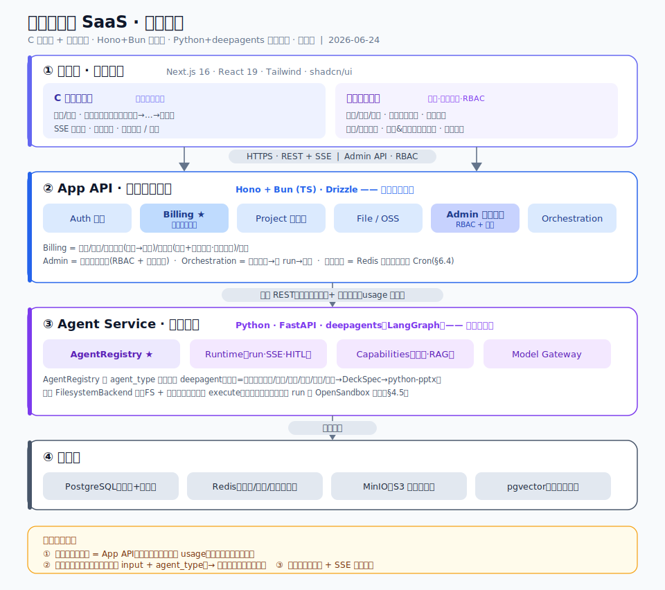
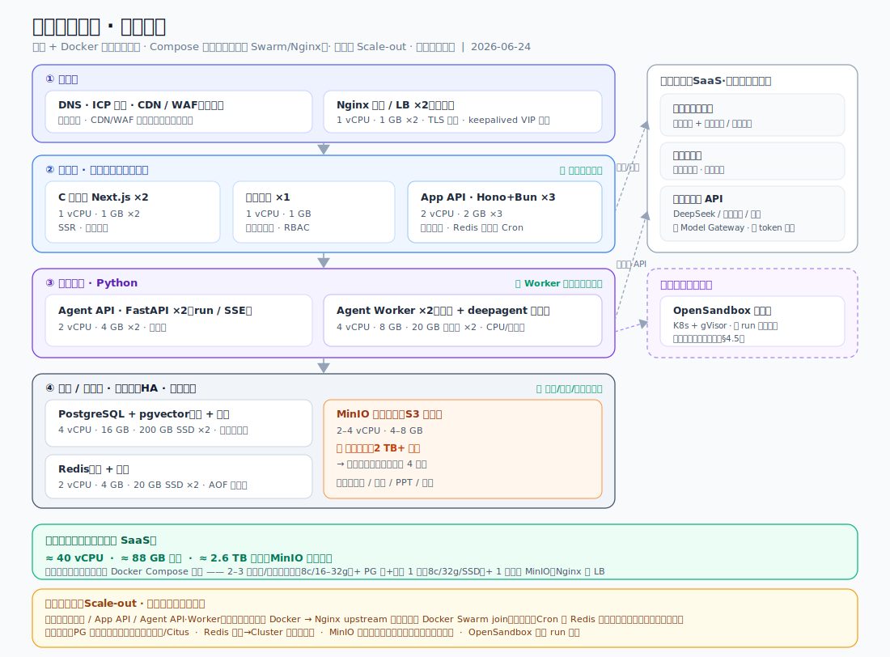
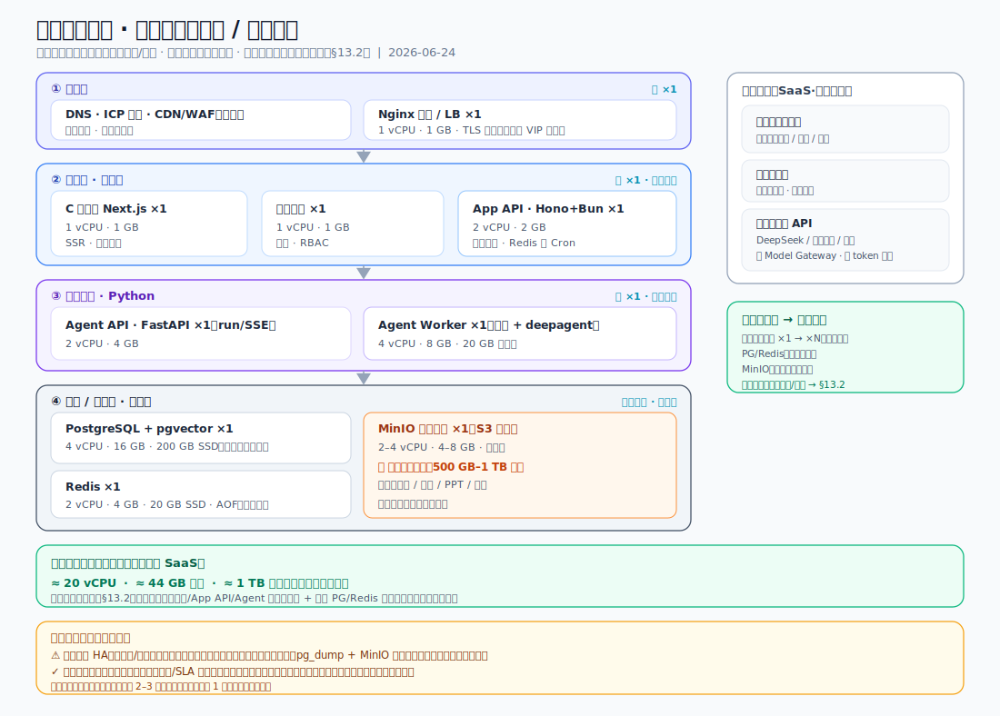
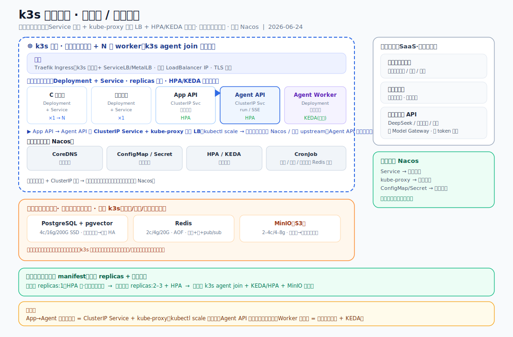

# 投标智能体 SaaS · 整体架构设计方案

> 版本：v1.0　|　日期：2026-06-24　|　状态：架构基线（待逐子系统细化）
> 范围：本文档为"整体架构方案"，定义服务边界、技术选型、数据模型与建设顺序。各子系统的详细设计（spec → plan → 实现）在后续单独迭代。

---

## 1. 背景与目标

### 1.1 现状
`Bid Assistant` 目录下是一个由 v0.app 生成的**纯前端原型**（Next.js 16 + React 19 + Tailwind v4 + shadcn/ui），无后端、无鉴权、全部 mock 数据。原型已把投标全流程的 UI、交互、文案、积分口径打磨成熟（详见 `docs/PRD.md`），但所有 AI 能力、账号、支付、数据持久化都是假的。品牌：「智启元 · 投标助手」。

**两套前端原型**（均为纯前端 mock，复用开发）：
- **C 端用户前端**（`Bid Assistant`，~5700 行）：
  - 公开区：`/` 落地页、`/login` 手机号+验证码登录
  - 智能编标：`/upload` 上传、`/read` 招标解读、`/outline` 提纲生成、`/content` 标书生成（三栏）、`/risk` 标书审查（废标风险+查重）、`/present` 述标演示
  - 我的：`/projects` 我的标书、`/library` 资料库、`/membership` 会员中心
- **运营管理后台前端**（`docs/admin-front`，Next.js 同栈）：6 个模块——概览看板 `/`、用户与会员 `/users`、订单与对账 `/orders`、积分账本审计 `/ledger`、套餐与积分口径 `/plans`、系统与权限 `/system`；**已含 RBAC 角色**（superadmin/ops/finance/support）、操作审计、套餐/积分口径配置等。运营后台**直接基于此原型开发**（与 C 端同思路）。

### 1.2 目标
基于该原型开发一个**面向 C 端的投标智能体 SaaS**，包含：
1. 账号与会员体系、订阅与支付（**收钱吧聚合扫码，无自动续费**）、积分计费
2. 投标全流程的真实 AI 能力
3. **智能体做成独立服务**：一个服务内按"智能体类型"注册多个 deepagent，投标是第一个；未来新增其它智能体只在该服务内扩展，不动骨架
4. **运营管理后台（必建，基于 `docs/admin-front` 原型开发）**：用户/会员/订单管理、积分账本审计、支付对账、套餐与积分口径配置、邀请奖励、智能体/模型配置、数据看板、退款/客服处理（工作流模板配置暂不支持，§8）。**没有它系统无法运营**——配置、对账、退款、风控都依赖后台，故列为第一级必建范围。计费/邀请/配置的详细需求见《支付与计费系统 · 开发需求规格》（`docs/支付与计费系统 · 开发需求规格.md`）。

### 1.3 关键决策（已拍板）
| 项 | 决策 |
|---|---|
| 部署/合规区域 | 中国大陆 + 云厂商（阿里云/腾讯云），ICP 备案、国内短信、国产大模型 |
| 应用层技术栈 | **已选 A：Hono + Bun (TS) + Drizzle ORM**（与前端同栈、类型端到端、迭代快；原型已埋 hono）。备选 B/C/D 见 §2.4 |
| 智能体层技术栈 | **Python + FastAPI + LangGraph（骨架）+ deepagents（正文等开放式节点）** |
| 智能体形态 | 单服务 + AgentRegistry，按 `agent_type` 注册多个 deepagent |
| 支付 | **收钱吧聚合支付（C 扫 B 跳转支付）**：商家侧只对接收钱吧一家，用户用微信/支付宝扫码均可付；**不做自动续费/周期代扣**（产品决策，2026-07 调整） |
| 运营主体 | 已有企业主体（营业执照）→ 收钱吧商户入网（商户号/门店/激活码由收钱吧商务提供） |
| 交付节奏 | 先整体架构（本文档）→ 再逐子系统细化 |

---

## 2. 技术选型与调研结论

### 2.1 选型总览
```
前端       Next.js 16 + React 19 + Tailwind v4 + shadcn/ui
             · C 端用户前端（复用现有原型）
             · 运营管理后台（基于 `docs/admin-front` 原型·RBAC 权限）★必建
应用层     【已选 A】Hono + Bun + Drizzle ORM（TS）
             备选见 §2.4：B.Java/Spring · C.Go/Gin · D.全 Python/FastAPI
智能体层   Python + FastAPI + deepagents（LangGraph）
产物渲染   docx（标书导出 Word，App 层 TS）· python-pptx（述标导出 .pptx，Agent Service Python 侧）
数据       PostgreSQL（业务+账本）· Redis（会话/队列/限流）· MinIO（S3 兼容对象存储·文件）· pgvector（向量检索）
支付       收钱吧聚合支付（C 扫 B 跳转支付；HTTPS+JSON 直连网关，无 SDK 依赖）
基础设施   MinIO 自托管对象存储（文件，S3 API）· 阿里云：短信服务、国产大模型 API、容器部署
模型       DeepSeek / 通义千问 / 智谱（经 Model Gateway 可切换）
```

> 架构边界与数据模型语言无关：即便未来更换应用层语言，"钱只在 App API、智能体服务对业务无知、Payment Provider 抽象、积分账本模型"均不变；换语言只换应用层实现，前端与 Python 智能体层不受影响。下文涉及具体实现（如 §2.2 Bun 兼容性、数据模型示例 ORM）以**已选方案 A** 表述。

> **对象存储用 MinIO（自托管，S3 兼容）**：文件数据自主可控、不出域；代码统一用 **S3 SDK + 预签名 URL（直传/直下）**，访问控制走 S3 STS/预签名，不绑定厂商。因 MinIO 与阿里云 OSS 均兼容 S3 API，未来若要换托管 OSS 仅改 endpoint/凭证，业务代码与数据模型不变。

### 2.2 Bun 运行时兼容性调研结论（仅方案 A 相关，已验证，绿灯）
> 应用层已选 **A（Hono+Bun）**，本节适用并已验证。

对"支付/短信 SDK 在 Bun 上的兼容性"做了专项调研，结论：**可以上 Bun + Hono，带工程纪律即可。**

| 组件 | 结论 | 关键点 |
|---|---|---|
| **收钱吧聚合支付（现行方案）** | ✅ 零兼容性风险 | 无 SDK 依赖：HTTPS+JSON 直连网关；签名仅 MD5（请求）与 `SHA256WithRSA` 公钥验签（回调，`crypto.verify` 用大写算法名即可，新版 Bun 已修） |
| ~~支付宝 `alipay-sdk`~~（已弃用） | ✅ 能用（存档） | 2026-07 改收钱吧后不再引入；当时结论：依赖树纯 JS、大写 `RSA-SHA256` 绕开 Bun crypto bug #21354 |
| ~~微信支付 `wechatpay-axios-plugin`~~（已弃用） | ✅ 可用（存档） | 同上，不再引入；当时结论：2 坑可规避（oaepHash 强制 SHA-1 良性；`crypto.verify` 大写算法名） |
| 阿里云短信 `@alicloud/dysmsapi20170525` | ✅ 风险很低 | 纯 JS，底层仅 `node:http` + HMAC-SHA |
| Bun 生产成熟度 | ✅ 跑 HTTP/JSON API 已成熟 | 唯一系统性坑是 node-gyp 原生模块；本栈天然不碰。2025-12 Anthropic 收购 Bun，长期可持续性有强背书 |

**工程纪律（必须遵守）**：
1. 锁最新 Bun（≥1.2.16，建议 1.3.x），依赖版本锁死防上游引入 native 包
2. 支付/短信链路上线前必做沙箱端到端冒烟（下单签名→回调验签、敏感字段 OAEP 加解密、短信真实发送）
3. 主动避开 native 模块：密码哈希用 `Bun.password`，ORM 用 Drizzle（纯 JS），不碰 `bcrypt`/`sharp`/旧 `sqlite3`
4. 部署走容器（官方 `oven/bun` 镜像），不用阿里云 FC 函数（serverless 适配器不走 Bun 运行时）
5. 运行时兜底：Hono 运行时无关，万一某依赖在 Bun 崩，该服务可原样切回 Node，业务代码不改

### 2.3 支付方案调研结论（2026-07 决策更新：改用收钱吧）

**现行决策（2026-07）**：产品层面**放弃自动续费/周期代扣**，会员续费统一走「到期提醒 + 用户主动扫码续费」。据此，支付通道改用 **收钱吧（Wosai）聚合支付 C 扫 B 跳转支付**：
- 商家侧只对接收钱吧一家，用户用**微信/支付宝扫同一个码**均可支付（聚合能力正是其长项）；
- 单笔主动收款正是收钱吧的核心场景（跳转支付/退款/查询/回调齐备），接口为 HTTPS+JSON 直连，无 SDK 依赖；
- 不再需要支付宝/微信直连的商户资质、签约模板与两套回调栈，接入与对账都收敛为一家。

**历史评估（存档，当时结论已随产品决策失效）**：曾评估收钱吧"不适合做会员订阅"——其 API 只有单笔主动收款，无签约/委托代扣/周期扣款接口，预下单是"主动确认型"无法后台静默扣款。该结论建立在"要做自动续费"的前提上；放弃自动续费后不再构成否决理由。原备选（支付宝周期扣款/微信自动续费直连）转为存档，未来若重启自动续费再评。

### 2.4 应用层技术栈方案对比（已选 A）
> **决策：选定 A（Hono + Bun + TS + Drizzle）** —— 与前端同 TS、类型端到端打通、迭代快、多语言运维成本低；原型已埋 hono。下表 B/C/D 转为备选记录，不再是待定项。
> 另有备选 **D. 全 Python（FastAPI）**：既然智能体层必为 Python，App 层也可收敛为单语言后端；本次未选（放弃与前端同栈）。
应用层（App API）的各备选，架构边界完全一致，差异仅在实现语言/生态/团队成本。

| 维度 | **A. Hono + Bun (TS)** | **B. Java + Spring Boot** | **C. Go + Gin/Echo** |
|---|---|---|---|
| 与前端同栈 | ✅ 同 TS，类型端到端打通 | ❌ 异语言 | ❌ 异语言 |
| 开发迭代速度 | 快 | 慢（样板多、偏重） | 中 |
| **支付/财务生态** ★ | 支付宝官方 Node SDK ✅；微信仅社区 | **最成熟**：支付宝/微信**官方 Java SDK**，财务/对账系统先例最多 | 微信**官方 Go SDK** ✅；支付宝靠社区 gopay |
| 强类型 / 事务 / 并发 | 单线程事件循环，够用 | 最成熟（Spring Data/事务/Batch） | 强并发、低延迟 |
| 性能 / 部署成本 | 轻快、镜像小 | 重、启动慢、吃内存 | **最优**：单二进制、低内存、云原生 |
| 定时任务（对账/过期/到期提醒） | 统一用 **Redis 分布式锁定时任务**（见 §6.4），语言无关，不再是差异项 | 同左 | 同左 |
| 招聘面 | 中 | 最广 | 中 |
| 团队心智成本 | 低（小团队友好） | 高 | 中 |
| ORM | Drizzle（纯 JS） | MyBatis / JPA(Hibernate) | sqlc / GORM |

**关键洞察**：支付宝与微信支付的**官方 SDK 都首选 Java**，国内财务/对账系统 Java 先例最多——若把"钱的正确性/长期稳健"放第一优先级，Java 在支付这层有客观优势；Go 在微信侧有官方 SDK、支付宝靠社区；TS 支付宝官方、微信社区（兼容性已在 §2.2 验证）。

**选 A 的理由（B/C/D 仅作存档备选）**：
- **A. Hono+Bun（✅ 已选）**：迭代速度优先、小团队、与前端同栈（TS 端到端）；原型已埋 hono。
- B. Java/Spring Boot：财务稳健第一、有 Java 班底、追求长期稳。
- C. Go：性能/成本/云原生优先、有 Go 班底。
- D. 全 Python/FastAPI：收敛为单语言后端（与智能体层同栈），代价是放弃与前端同栈。

> 已按 **A 落地**：本文档其余章节均以方案 A 表述。B/C/D 仅留作记录；若未来更换，按等价组件替换（Web 框架 / ORM / 定时任务 / 支付 SDK），架构与数据模型不变。

---

## 3. 整体架构与服务边界

### 3.1 四层架构



> 上图为架构总览（SVG，可缩放）。下方 ASCII 图为等价文本版，便于在纯文本环境查看。

```
┌──────────────────────────────────────────────────────────────┐
│  前端层 (Next.js 16) —— 两套前端                                │
│  ① C 端用户前端(复用原型)：mock→真实 API、登录态、SSE、积分余额  │
│  ② 运营管理后台(基于 admin-front 原型)：用户/会员/订单/账本/对账   │
│     /套餐&积分口径/模型配置/数据看板，RBAC+操作审计              │
└───────┬───────────────────────────────────┬──────────────────┘
        │ HTTPS / REST + SSE                │ Admin API (RBAC)
┌───────▼───────────────────────────────────▼──────────────────┐
│  App API · 应用与计费层 (Hono + Bun · TS，见 §2.4)            │
│  ┌─ Auth        手机号+验证码、JWT/会话                        │
│  ┌─ Billing     会员/订阅/积分账本/支付/到期续费 ← 计费唯一权威  │
│  ┌─ Project     投标项目状态机、文件元数据、产物版本            │
│  ┌─ File        MinIO/S3 预签名直传凭证、文件生命周期           │
│  ┌─ Admin       运营后台接口：RBAC 鉴权 + 操作审计 ← 服务运营前端 │
│  └─ Orchestr.   业务请求→智能体任务：预扣积分→建 run→结算       │
└───────────────┬──────────────────────────────────────────────┘
                │ 内部 REST（服务间鉴权）+ 任务回调
┌───────────────▼──────────────────────────────────────────────┐
│  Agent Service · 智能体层 (Python / FastAPI + deepagents)      │
│  ┌─ AgentRegistry   按 agent_type 注册多个 deepagent ★可扩展核心 │
│  ┌─ Runtime         统一 run API、异步执行、SSE 流式产出         │
│  ┌─ Capabilities    文档解析(docx/pdf/xlsx)、RAG检索、HITL      │
│  ┌─ Model Gateway   DeepSeek/通义/智谱 可切换、用量上报         │
│  └─ 不碰钱：只上报 token/usage，计费回 App API                  │
└───────────────┬──────────────────────────────────────────────┘
                │
┌───────────────▼──────────────────────────────────────────────┐
│  数据层  PostgreSQL(业务+账本) · Redis(会话/队列/限流)          │
│         · MinIO(S3兼容对象存储·文件) · pgvector(招标文件向量检索) │
└──────────────────────────────────────────────────────────────┘
```

### 3.2 三条边界铁律
1. **钱只有一个权威 = App API**。智能体服务永不扣积分、不碰支付，只在任务结束上报实际 usage，由 App API 完成"预扣→结算/退差"。计费逻辑集中、可审计。
2. **智能体服务对业务无知**。它只认识"任务输入 + agent_type"，不知道"投标项目"概念。投标业务编排（哪步调哪个智能体、产物存哪）留在 App API。这是未来加新智能体能复用的前提。
3. **长任务一律异步**。生成整本标书可能数分钟，走任务队列 + SSE 进度回传，不做同步 HTTP 等待。

### 3.3 前端访问拓扑（两端独立 · 后台单独加固）
C 端前端与运营后台是**两个独立部署的 Next.js 应用**（`apps/web` / `apps/admin`），分开访问；**后端是同一个 App API**，两端打不同路由组。

| 前端 | 开发期 | 生产期入口 | 可访问对象 | 后端路由 |
|---|---|---|---|---|
| C 端用户前端 `apps/web` | `localhost:3000` | `app.<域名>`（公网） | 所有注册用户 | 业务路由 |
| 运营管理后台 `apps/admin` | `localhost:3001` | `admin.<域名>`（独立子域） | 仅运营人员 | `/admin/*`（RBAC + 操作审计） |

**生产用「不同子域名」而非「对外暴露不同端口」**：反代/Ingress（Nginx 或 k3s Traefik）按子域路由到对应前端容器。后台因权限极大（改套餐/调积分/退款/封号），额外三层加固：
1. **独立账号体系**：后台走 `admin_users` + RBAC（superadmin/ops/finance/support），与 C 端 `users` **完全分开**（§5.2）。
2. **网络管控**：后台子域建议 **IP 白名单 / 内网 / VPN** 可达，后台流量小，可不暴露公网。
3. **审计**：后台敏感操作全留 `admin_audit_logs`（前后值）。

> 「两个前端」≠「两套后端」：二者共用 App API，C 端走业务路由、后台走 `/admin/*`（架构图 App API 的 Admin 模块，§3.1）。

---

## 4. 智能体服务详设（可扩展核心）

形态：**一个 Python 服务，以 LangGraph 为骨架按 `agent_type` 注册多条工作流；节点按需用 `create_agent` / deepagent / 普通服务（异构）。** 即 **LangGraph + deepagents 混合**：LangGraph 管确定性骨架，deepagents 管开放式节点（正文生成）。

### 4.1 注册式架构 —— 新增智能体 = 注册一个新类型
每个 `agent_type` 对外是一个 **`CompiledStateGraph`**（LangGraph 的编译图）；它**可以是一条显式 LangGraph 工作流，也可以整体是一个 deepagent**——对 App 都是统一 run 契约（§4.3），App 无感。

```python
# agent_type → CompiledStateGraph（LangGraph 工作流 / deepagent，统一对外）
AGENT_REGISTRY = {
  "bidding_agent": build_bidding_workflow(),   # 投标 = LangGraph 显式工作流，节点异构（见 §4.2）
  # 未来扩展：加一行即可，服务骨架不动
  # "contract_review": build_contract_workflow(),
  # "proposal": build_proposal_workflow(),
}
```

> **为什么投标是"工作流"而非"一个大 deepagent"**：投标流程已知且固定、平台预制（§10）、要按步计费与可观测——骨架交给**显式 LangGraph** 更可控、低风险；只在确需开放式规划的节点（正文生成）才用 deepagent。详见 §4.2 的逐节点框架选型与 §10.2 两层编排。

### 4.2 投标工作流的节点（异构：create_agent / deepagent / 普通服务）
`bidding_agent` 是一条 **LangGraph 显式工作流**，节点对应 PRD 全流程；**每个节点按性质选最合适的框架**——不强行都用 deepagent：

| 节点 | 页面 | 输入 → 产出 | 框架选型 | 为何 |
|---|---|---|---|---|
| 读标 `read` | `/read` | 招标文件 → 六大分类解读 + 废标风险点 | **LangGraph `create_agent`** + 工具 | 结构化抽取/分类，确定性强 |
| 提纲 `outline` | `/outline` | 解读结果 → 技术标/商务标大纲 | **LangGraph `create_agent`** | 结构化生成，可加轻量规划 |
| **正文 `content`** | `/content` | 大纲+RAG → 逐章正文 + 章节级 AI 对话改写 | **deepagent** | 长文/多章/需规划+子agent+草稿，开放式（deepagents 甜点） |
| 审查 `risk` | `/risk` | 招标+投标文件 → 废标风险体检 | **LangGraph**（规则+RAG 比对） | 要可解释、流程别飘 |
| 查重 `dedup` | `/risk` | 多份投标文件 → 多维指纹相似度 | **普通服务** + 少量 LLM 辅助 | 指纹/相似度算法，基本非 LLM agent |
| 述标 `present` | `/present` | 标书 → **`DeckSpec`（大纲+口播稿+问答）** → 渲染层产 **.pptx** | **LangGraph `create_agent`** | 产结构化 DeckSpec；要多轮打磨再上 deepagent |

> **deepagent 只在「正文生成」节点用**：它自带的规划(todo)/虚拟文件系统/子智能体/HITL 契合"写整本标书"——主 agent 规划章节、子 agent 并行写、虚拟 FS 暂存草稿、关键处回审；配虚拟 FS 还能随 checkpoint 续跑（§4.7）。其余节点用更确定的 `create_agent` / 普通服务，便于**按步计费**与**可解释**。
> **关键**：`deepagents = create_agent + middleware(Filesystem/SubAgent/TodoList)`，所以骨架统一 LangGraph，哪个节点真需要就叠 deepagent 的 middleware——**一个节点一个决定，可增量、可回退**；deepagents 的不确定性与版本风险（#573/#1251，§4.7）**关在单个节点内**，对 App 的统一 run 契约不变。

#### 4.2.1 述标 PPT 生成：「智能体产稿 + 渲染层产文件」两段式
让 LLM 直接吐 PPT 二进制必然不稳。把生成拆成两层，职责清晰、结果可复现：

```
全流程标书 chapters
   │
   ▼
① 述标智能体（deepagent，LLM）        ② PPT 渲染器（确定性代码，非 LLM）
   · 评分点导向大纲                       · 套企业模板/母版/配色
   · 每页要点 + 口播稿(notes)     ──→     · python-pptx 渲染
   · 述标问答预演(QA)              DeckSpec  · 输出 .pptx
   · 按时长裁剪(10/15/20 分钟)      (JSON)   │
                                            ▼
                                    上传对象存储(MinIO) → 返回下载凭证 → 前端预览+下载
```

设计要点：
1. **智能体只产 `DeckSpec`（结构化 JSON，非文件）** —— 即现有 `lib/present.ts` 中 `Slide[]`/`QA[]` 结构的正式版；结果可单测、可复现。
2. **渲染层确定性、归 Python 侧** —— 用 `python-pptx`，与文档解析（读标侧）同语言同服务；不引入 Bun 对 `pptxgenjs` 的额外兼容性验证。
3. **套企业模板归渲染器，不归 LLM** —— 政企客户最在意"用自己的 PPT 模板"，属母版/占位符/排版工程问题，由渲染器处理。
4. **前端零改造复用** —— 现有 `/present` 页本就吃 `Slide[]` 渲染网页预览；正式版让智能体回填同一结构，预览直接复用，仅多一个"下载 .pptx"按钮。
5. **边界铁律不破** —— 智能体只产 `DeckSpec` + 上报 usage，不碰钱；积分预扣/结算仍由 App 层 Billing 管（述标在积分消耗表中本有一档）。

### 4.3 统一对外契约（所有 agent_type 共用，复用接口层）
```
POST /agents/{agent_type}/runs    创建任务 → run_id（input + 文件引用 + 上下文）
GET  /runs/{run_id}/stream        SSE 流式产出（进度、思考、增量正文）
GET  /runs/{run_id}               查询状态/结果
POST /runs/{run_id}/resume        HITL 恢复（用户确认后继续）
回调 → App API：run 完成时上报 usage（token/时长）供结算
```

### 4.4 横切能力（所有智能体共享，不重复造）
文档解析（docx/pdf/xlsx）、RAG 向量检索（招标文件入 pgvector）、Model Gateway（国产大模型可切换 + 故障转移）、用量埋点、限流。

**智能体编写框架**：把智能体服务做成**可复用框架**，新增智能体 = 写一个 `BaseAgent` 子类 + 注册，复用以下框架层：
- **BaseAgent 基类** + agent_type 注册 + 统一 `astream` 契约（§4.3）。
- **Hook/中间件管线**：上下文注入、输出契约校验、丢弃畸形 tool call、工具强制（force tool_choice）、可扩展插点。
- **可插拔 Backend 协议**（`create_backend_tools` 长出文件工具）：in-state 虚拟 FS（§4.5）/ DB / MinIO 持久后端三选。
- **健壮性层**：resilient tool node（工具重试）、幻觉守卫、错误自救路由。
- **上下文压缩节点**（token 窗口管理，长标书生成必需）。
- **结构化输出 submit-tool**（Pydantic 强约束 schema → 前端事件 / DeckSpec / 标书章节）。

> 复用效果：未来做"合同审查""方案撰写"智能体，复用 Runtime + 上述框架层 + 横切能力 + 统一 API，只写新 agent_type 的 `BaseAgent` 子类 + 节点定义 + App 层业务编排即可。框架与具体智能体解耦。

### 4.5 执行后端（Backend）选型 —— 不给 agent 开 shell

deepagents 把"执行能力"抽象成 **backend protocol**：`BaseSandbox` 只要求实现一个 `execute()`，框架就用 shell 命令 + Python 小脚本把 `ls/read/write/edit` 等文件工具「长」出来；只有 backend 实现了 `SandboxBackendProtocol`，`execute` 工具才真正可用，否则返回错误。优点是接入成本低（Modal/Daytona/Runloop 包一层 `execute()` 即可）、框架边界干净。**但 deepagents 只提供抽象层，不提供强制隔离（enforcement）**——隔离责任甩给 backend provider。`LocalShellBackend` 源码注释明确：unrestricted local shell，无 sandboxing / 无进程隔离 / 无资源限制，**仅本地开发**。

**关键澄清：「部署到 Docker」≠「agent 执行隔离」。**

| | 解决 | 不解决 |
|---|---|---|
| Docker 包整个服务 | 服务 ↔ 宿主机隔离（部署单元） | **租户 A 的 run ↔ 租户 B 的 run** |
| per-run sandbox | 每次执行之间的隔离 | — |

`LocalShellBackend` 是在**服务自己的容器内**开不受限 shell。本产品是 C 端多租户 SaaS，同一 Agent Service 容器同时跑大量用户 run，**共享文件系统与进程空间**：张三的 agent `cat` 就能读到李四上传的标书、`rm -rf`/fork 炸弹会拖垮所有人、逃逸即打内网。Docker 隔的是服务与宿主机，**不隔 run 与 run**。故 **`LocalShellBackend` 严禁上生产**。

**本产品的正解：投标管线根本不需要 `execute()`。** 读标/提纲/正文/审查/查重/述标全是**确定性工具**（文档解析、RAG 检索、LLM 生成、`python-pptx` 渲染），无一处需执行 LLM 临场生成的代码。因此：

```
默认 backend = FilesystemBackend（state 内虚拟文件系统）+ 自定义工具
  · 不挂 SandboxBackendProtocol → execute 工具按设计「不可用」
  · agent 无 shell 执行面，攻击面仅剩自写工具代码
  · 服务本身仍跑容器（纵深防御），但那是部署，不是 agent 隔离
```

**三条决策铁律**：
1. **投标管线默认 `FilesystemBackend`（虚拟 FS）+ 自定义工具，关闭 `execute`**，不挂 sandbox backend。
2. **`LocalShellBackend` 仅限本地开发，禁止上生产。**
3. **架构预留 —— 选定 OpenSandbox 做每 run 一次性沙箱**：未来若有需执行不可信代码的智能体（典型：数据分析智能体跑用户上传表格），隔离粒度是**「每次 run」而非「整个服务一个容器」**，用完即焚。选定 **OpenSandbox**（阿里云开源，2026-03 开源、Apache 2.0、gVisor 内核级隔离、自托管 Docker(开发)/Kubernetes(生产)、多语言 SDK 含 Python），通过 `SandboxBackendProtocol` 接入，不污染现有管线。

> 一句话：execution 隔离的粒度是「每次 run」，不是「整个服务一个容器」。本产品当前阶段连 execution 面都不开。

#### 4.5.1 OpenSandbox 接入契约（未来需 execution 时启用）
**为什么是它**：① gVisor 内核级隔离 + 每 sandbox 网络出口策略/资源限额，满足多租户「run 与 run 互隔」的硬要求；② Apache 2.0，商用无授权顾虑（对比 n8n Embed 需商业授权）；③ 自托管 K8s 部署，契合「数据不出境 + 自主可控」基线（与自托管 MinIO 同一思路）；④ 阿里云出品，与短信/大模型生态衔接顺。

**接入方式**：deepagents 只要一个可靠的 `execute()`，把 OpenSandbox 的 `commands.run()` 包一层即成 `SandboxBackendProtocol` 实现——其 `Sandbox.create()/async with` 天然就是「每 run 创建、用完销毁」的生命周期。

```python
# 把 OpenSandbox 适配成 deepagents 的 sandbox backend（示意）
class OpenSandboxBackend:                     # 实现 SandboxBackendProtocol
    async def __aenter__(self):
        self._sb = await Sandbox.create(IMAGE, timeout=timedelta(minutes=10))
        await self._sb.__aenter__()           # per-run 生命周期：开
        return self
    async def execute(self, command: str):    # deepagents 用它长出 ls/read/write/edit
        return await self._sb.commands.run(command)
    async def __aexit__(self, *exc):
        await self._sb.__aexit__(*exc)        # per-run 生命周期：用完即焚
# 文件进出：sandbox.files.write_files() 喂输入、read_file() 取产物
# 部署：生产用 OpenSandbox 的 Kubernetes runtime 调度，每 run 一个隔离沙箱
```

**仍不变的边界**：① 沙箱只在「确有不可信代码执行」的智能体启用，投标管线不挂；② 沙箱内仍只上报 usage，不碰钱（计费回 App API）；③ 沙箱镜像/网络出口走最小权限白名单。

### 4.6 Agent API 与 Worker 拆分 —— 一仓两角色 + 一条缝

deepagent 一次 run 是**分钟级、CPU/内存重**的长任务（解析 + 规划 + 子智能体）。结论：**同一代码库/镜像，跑成两个进程（API 角色 + Worker 角色），用队列 + pub/sub 解耦——不把 deepagent 执行塞进 API 进程。**

**为什么不合进一个进程**：① 长执行阻塞同进程的大量 SSE 长连接，尾延迟爆炸；② API 按连接数扩、Worker 按队列深度扩，资源画像不同（部署图 API 2c/4g vs Worker 4c/8g），合一只能一种规格扩；③ 一个跑飞的 run（OOM/死循环）会连带打掉给所有人推流的 API。
**为什么不拆两个代码库**：二者共享 `AgentRegistry`/deepagent 定义/工具/Model Gateway/文档解析，拆仓必漂移、重复维护。

```
一个 Agent Service 代码库/镜像
  ├─ 入口 A：agent-api    (uvicorn)   建 run、查状态、SSE 推流   [无状态, 按连接扩]
  └─ 入口 B：agent-worker (consumer)  真正跑 deepagent           [重计算, 按队列扩]
       共享：AgentRegistry / deepagent 定义 / 工具 / Model Gateway / 文档解析

缝（都在现有 Redis 上，零新组件）：
  · 派发：API 建 run → 入队(Redis Stream/队列) → Worker 消费
  · 回传：Worker 把增量产出/进度 publish 到 run:{id} 频道
          → API 的 SSE handler 订阅该频道 → 转发前端
  · 完成：Worker publish 完成事件 + 回调 App API 上报 usage（仍不碰钱，§3.2 铁律①）
```

**关键：这条缝（队列派发 + pub/sub 回传）从第一天就设计进去。** Phase 1 可把 API/Worker 跑同机甚至同进程快速验证；上生产拆开只是改启动命令 + 加副本，不重写编排代码。与部署图 ③ 智能体层 `Agent API ×2` + `Agent Worker ×2`、Worker 单独扩并发一致。

### 4.7 状态持久化 · LangGraph Checkpointer（配 deepagents）
LangGraph 用 **checkpointer（`BaseCheckpointSaver`）**在每个 super-step 存盘图状态——这是「Agent 无状态 + 任意 Worker 续跑 + HITL 恢复」的底座。deepagents 建在 LangGraph 上，**checkpointer 直接传给 `create_deep_agent`**。

**选型**：用 **`PostgresSaver`**（`langgraph-checkpoint-postgres`），落在已有中间件 PG（裸机）的**单独 schema/库**，归 Agent Service 自管。
```python
from langgraph.checkpoint.postgres import PostgresSaver
agent = create_deep_agent(..., checkpointer=PostgresSaver(...))   # deepagents 直接吃
# 每次执行带 thread_id：
agent.invoke(input, config={"configurable": {"thread_id": run_id}})
```

**带来什么（对应已设计的能力）**：
1. **HITL interrupt/resume** —— §4.3 的 `POST /runs/{run_id}/resume` 就靠它：节点 `interrupt` → 用户确认 → 从 checkpoint 续跑（**HITL 必须有 checkpointer**）。
2. **崩溃恢复（durable execution）** —— Worker 跑一半挂了，换个 Worker 从最近 checkpoint 接着跑（§4.6 队列接管的前提）。
3. **Agent 无状态** —— §13 说的「run 状态在 PG」具体就是 PostgresSaver 的 checkpoint，状态不在进程内，故 k3s 纯轮询不用粘连。
4. **time-travel** —— 回放某步状态，调长流程。

**deepagents 专属要点（必须讲清）**：
- **`thread_id` = 我们的 `run_id`**（按 run 开 thread，天然隔离）；通过 `config.configurable.thread_id` 传。
- **虚拟文件系统会被一起 checkpoint**：我们用 §4.5 的 **`FilesystemBackend`（state 内虚拟 FS）**，所以 deepagents 的**虚拟文件 + 规划 todos + 消息历史全在图 state 里 → 全部进 checkpoint → 可完整续跑**。⚠ 反之若用 sandbox/外部 backend，文件落在 state 之外、**不进 checkpoint**——这是选 backend 时的隐藏差异，我们选虚拟 FS 正好规避。
- **⚠ 子智能体的 checkpoint 短板（deepagents #573，已修但版本相关）**：历史上**主 agent 有 checkpointer、子 agent 编译时没传**，导致：① 子 agent 中间过程（工具调用/推理）不被持久化，只把**最终文本**回传主 agent；② 崩溃时只能从主 agent 的「派子任务前/后」最近 checkpoint 恢复，**不能从子 agent 执行中途续跑**。落地时**锁定 deepagents 版本并验证该修复是否生效**；若用到受影响版本，按官方建议「先建 checkpointer 再建 agent / 给子 agent 显式传 checkpointer」处理（与之前记录的 config 不向子 agent 传播是同源问题）。

**两层状态别混**（把 §13 措辞说精确）：
- **进度/增量产出 → Redis pub/sub**（易失，仅推流 SSE 用，§4.6）。
- **可靠执行状态 → PG checkpointer**（持久，续跑/HITL 用）。
- checkpointer 表是「智能体执行状态」，与 App 的 `agent_runs`（业务桥接：run_id/usage/积分关联）**分两处**，守边界②。

---

## 5. 计费与数据模型

### 5.1 积分账本（Credits Ledger）—— append-only 事件账本
不维护"可被随手改的余额数字"，而是**只追加的流水账**，余额 = 流水之和（+ 余额缓存做对账）。每笔 AI 操作走**预扣→结算**两段式。

```
credit_transactions（只追加，每行一笔变动）
  ├─ type:  grant(会员/注册赠送) | purchase(充值) | hold(预扣)
  │         | settle(结算) | release(退还) | expire(过期)
  │         | referral_reward(推荐奖励，§6.5)
  ├─ amount: +/- 积分
  ├─ source_batch: 来源批次（用于过期：会员月度赠送有效期 ≠ 充值积分）
  ├─ ref:    关联的 agent_run / 订单 / 套餐
  └─ idempotency_key: 幂等键，防重复扣减

一次「标书生成」的积分生命周期：
  1. 校验余额够 → 写 hold(-80) 预扣        （余额冻结，防并发超扣）
  2. 调智能体服务执行
  3a. 成功 → 按实际 usage 写 settle，多退少补
  3b. 失败 → 写 release(+80) 全额退还
```

**三条铁律**：① 钱只在 App API 动，智能体服务只上报 usage；② 所有扣减/回调带幂等键；③ 不同来源积分按"先过期先扣"消耗（FIFO by 过期时间）。

积分消耗口径沿用 PRD 第 4.4 节（读标 20 / 提纲 30 / 短篇生成 40 / 长篇 80 / 重写 25 / 废标审查 60 / 查重 100 / 导出 20）。

### 5.2 数据实体（七组）
> 计费/支付/账本/订阅/推荐/配置六张核心表的**完整字段**以《支付与计费系统 · 开发需求规格》为准（`docs/支付与计费系统 · 开发需求规格.md` 第四节）；本表给职责与边界，落地按规格建表。

| 组 | 主要表 | 职责 |
|---|---|---|
| **账号** | `users`(账号本体)、`user_identities`(可插拔登录身份)、`sessions` | 一个账号可绑多种登录方式、登录态（见下注） |
| **运营后台** | `admin_users`、`admin_roles`(superadmin/ops/finance/support)、`admin_audit_logs` | 运营人员账号、RBAC 角色/权限、敏感操作审计（改套餐/调积分/退款/封禁均留前后值）。**与 C 端 `users` 完全分离**（独立身份/会话/子域，§3.3），Phase 3 建 |
| **会员订阅** | `plans`(套餐定义·数值全配置注入)、`subscriptions`(档位/周期/auto_renew/agreement_no) | 档位与续费状态 |
| **计费** | `credit_transactions`(账本·含 referral_reward)、`credit_balances`(余额缓存)、`payment_orders`、`payment_terminals`(收钱吧终端凭证)、`refunds` | 积分 + 支付 |
| **推荐与配置** | `referrals`(邀请关系·reward_state pending/unlocked/capped)、`billing_configs`(键值：积分口径/充值包/汇率/有效期/推荐规则/到期提醒天数，§6.6) | 邀请奖励 + 全参数配置 |
| **投标业务** | `projects`(状态机)、`project_files`(招标/附件→对象存储 MinIO/S3 引用)、`project_artifacts`(读标/提纲/正文/审查产物 + 版本) | 项目与产物 |
| **智能体桥接** | `agent_runs`(run_id、agent_type、状态、usage、关联项目/积分事务) | App ↔ 智能体服务的纽带 |

`agent_runs` 是关键桥接表：App 层发起一次 AI 操作就建一条 run，串起"项目 / 积分预扣事务 / 智能体执行 / 产物落库"。

**账号身份模型（C 端，可插拔 · 为第三方登录预留）**：`users` 只存账号本体（id/status/昵称/头像/时间戳），登录方式拆到 `user_identities`：
```
user_identities
  user_id → users.id (cascade)
  provider     'phone' | 'wechat' | 'alipay' | ...   ← 枚举可扩展，零 schema 改动加新登录
  identifier   手机号 / 微信 unionid / ...
  credential   预留(密码哈希等；phone/oauth 不用)
  verified_at, created_at
  UNIQUE(provider, identifier)
```
- 手机号登录 = `identity(phone, 手机号)`，短信验证通过写 `verified_at`。
- 第三方登录（微信/支付宝，后续）= 加一条 `identity(wechat, unionid)` + 一个登录路由，不改表。
- **账号绑定**：已登录用户给自己 `user_id` 再加一条身份 = 把微信绑到现有账号；一个微信-only 用户可暂无手机号、后补绑。
- Phase 0 仅实现 `phone` provider（spec003/spec004）。

### 5.3 会员档位
沿用现有代码的 C 端 3 档（`lib/plans.ts`：免费版 / 个人版 / 专业版），PRD 第 4.2 节列了更细的 5 档，最终档位以产品决策为准；本架构对档位数量无耦合（`plans` 表配置化）。会员中心的"渐进式套餐展示"（当前档+下一档）属前端展示逻辑，沿用原型。

---

## 6. 会员订阅与支付（收钱吧扫码单笔，无自动续费）★重点

> 2026-07 决策调整：支付通道改**收钱吧聚合支付（C 扫 B 跳转支付）**，**不做自动续费/周期代扣**（原 §6.2 整节移除）。会员续费 = 到期提醒 + 用户主动扫码续费（见 §6.2）。

支付层设计为 **Payment Provider 抽象**，屏蔽通道差异：

```
Billing 模块
 └─ PaymentProvider 接口（可插拔）
     └─ 单笔支付：下单(跳转支付URL/二维码) / 查询 / 回调验签 / 退款   ← 积分充值、购买/续费会员
     实现：ShouqianbaProvider（现行）；未来换通道只加实现、不动路由
```

### 6.0 收钱吧接入要点（C 扫 B-PRO）

**凭证层级与终端管理**（收钱吧商务/技术支持邮件提供开发者参数）：
```
vendor_sn + vendor_key + app_id（开发者身份，仅"激活"接口签名用）
  → 激活码 code（每门店一个，有"有效期+激活次数"限制）+ device_id（自定义设备号）
  → 调「激活」接口 → terminal_sn + terminal_key（交易终端身份，业务接口签名用）
  → 「签到」接口每日轮换 terminal_key（强烈建议每天签到；新 key 必须持久化）
```
- **终端参数落库**（`payment_terminals` 表）：terminal_sn/terminal_key/device_id 持久化并**集群共享**（多实例各自持 key 会签名错乱）；签到失败按收钱吧排障流程处理，极端情况用新激活码重激活。
- **同一设备只激活一次**；device_id 带业务含义（如 `bidsaas-prod-01`）。
- 网关 `https://vsi-api.shouqianba.com`，POST JSON；**生产即真钱**（测试激活码对应测试商户号，同一网关）；`X-Forwarded-For` 须传**顾客手机的真实公网 IP**（监管要求）。
- **两套签名**：非支付接口（激活/签到/查询/退款）用 `Authorization: sn + " " + MD5(body + key)`（激活用 vendor 参数、其余用 terminal 参数）；跳转支付（WAP2）用「参数 ASCII 升序拼接 + `&key=` 后接 terminal_key，MD5 转大写」。
- **回调验签**：收钱吧回调的 `Authorization` 头带 RSA 签名，用**收钱吧公钥**做 `SHA256WithRSA` 验签（公钥由收钱吧提供，存 env/配置，不入 git）。

### 6.1 单笔支付（积分充值 / 购买、续费会员）

1. 用户选充值包/套餐 → App API 创建 `payment_orders`（status=created，带幂等键；`client_sn`=我方订单号，全局唯一）
2. App 按 WAP2 规则拼**跳转支付 URL**（带 client_sn/total_amount(分)/subject/return_url/notify_url + MD5 签名）→ 转成**二维码**展示在收银页
3. 用户用**微信或支付宝**扫码 → 进入收钱吧 H5 确认页 → 点支付 → 唤起支付控件完成付款 → 页面跳回 `return_url`
4. **结果获取双通道**（以先到的终态为准，二者幂等合一）：
   - **回调**：收钱吧 POST `notify_url` → 公钥验签 → 订单置 paid → 写积分 `purchase` 流水 / 激活会员
   - **轮询兜底**：从发起跳转起订单有效期 **4 分钟**；后端按收钱吧规范轮询「查询」接口（0–1 分钟每 3s、1–5 分钟每 10s、第 6 分钟最后一次），仍无终态则订单置**未知态**待对账
5. 前端轮询我方订单接口 / SSE 收到状态变更

**幂等关键**：回调可能重复、且与轮询并发，按收钱吧订单号 `sn`（我方存 `provider_trade_no`）+ 订单状态机保证**只入账一次**；渠道单号 `trade_no`（微信/支付宝侧）、付款方式 `payway` 一并落库供对账。

### 6.2 会员续费（到期提醒 + 手动续费，无自动续费）

原"自动续费/周期代扣"方案（支付宝签约+代扣）已按产品决策移除；原"降级兜底"转正为唯一续费路径：

```
到期提醒 Cron（Redis 分布式单例定时任务，§6.4）：
  扫描 current_period_end 临近（T-7 / T-3 / T-1，天数可配）且 status=active 的订阅
    → 推送提醒（短信/站内信，防打扰去重）
用户在会员中心点「续费」
    → 走 §6.1 单笔支付（type=renewal，金额=所选套餐当期价）
    → 支付成功回调 → 续期 current_period_end、发放当期赠送积分(grant)
到期未续费：
    → status: active → expired（宽限期可配，宽限内为 past_due）
    → 权益降级为免费版；积分按流水规则保留/过期
```

- `subscriptions` 不再有 `auto_renew`/`agreement_no` 字段；`payment_agreements` 表**取消**（数据模型见《支付与计费系统 · 开发需求规格》）。
- 无代扣 → 无签约模板/扣款上限/代扣重试状态机等整套复杂度；合规上也无需周期扣款产品资质。

### 6.3 对账
每日对账任务（Redis 分布式定时任务，机制见 §6.4）：按 `payment_orders` 逐笔调收钱吧「查询」接口核对终态（含未知态订单清算），差异告警；如开通收钱吧商户后台对账单导出则以账单文件核对替代逐笔查询。积分账本可独立审计（余额 = Σ流水）。

### 6.4 定时任务调度机制（Redis 分布式单例 Cron）
对账、积分过期、到期提醒等周期任务统一用 **Redis 分布式锁实现"分布式单例 Cron"**，简单、稳、且语言无关（不引入 Spring Batch/Quartz/独立调度器）。

```
每个 App 实例内置分钟级 tick（每种语言都有定时器）
  → 执行前抢锁： SET lock:cron:<job> <instanceId> NX EX 300
       抢到 → 执行该 job；没抢到 → 跳过
       （保证集群内同一时刻只有一个实例在跑 = 分布式单例）
  → Job 体以「DB 为准」查到期项，逐条幂等处理
  → 完成后释放锁（Lua CAS 仅删自己持有的锁）；长任务用 watchdog 续租
```

**为什么这样最简单又稳**：
1. DB 是"什么到期"的唯一真相，Redis 只保证"同一时刻单实例执行" → 不重复跑
2. 业务幂等键兜底（如提醒幂等键=订阅+提醒档、过期幂等键=批次）：即使锁异常/双触发也不会重复处理
3. 自愈：实例挂了锁 TTL 自动过期，下一 tick 自动接管
4. Redis 数据层已在用，零额外组件

> 进阶（当前不需要）：若到期扫描量极大、不想全表扫，可换 **Redis ZSET 延迟队列**（score=到期时间，`ZRANGEBYSCORE` 弹出到期项）。当前会员量级"锁+扫表"足够，遵循"简单"原则。

### 6.5 推荐奖励（邀请引擎 · 规则全配置化）
实现一套**通用邀请奖励引擎**，奖励数值/解锁条件/封顶/有效期**全部来自配置**（`billing_configs`，§6.6），代码不写死。

- **关系**：`referrals`(inviter_id、invitee_id、code、status、reward_state)；邀请码绑定邀请人，被邀请人注册即建关系。
- **两段发放**：① 立即发放；② 延迟解锁（触发条件如"被邀请人首次付费"由配置开关决定）。奖励落 `credit_transactions` 的 `referral_reward` 流水，带有效期（配置）。
- **双方额度**：邀请人/被邀请人各自额度 = 配置值。
- **封顶**：单用户奖励达上限 → `reward_state=capped`，不再发。
- **防刷（风控）**：手机号/实名/设备唯一校验；异常邀请（同 IP 段、集中时段、注册即弃）标记冻结，留风控审计。
- **边界**：奖励仍是积分账本里的一笔（§5.1），走同一套幂等/过期/FIFO 规则；发放/手动调整由运营后台操作并审计。

### 6.6 配置化与种子配置（运营注入，开发只读不写死）
所有"可调数值"集中到 **`billing_configs`（键值表）**，运营后台是它的可视化管理面；开发期用**种子配置文件**占位，后台 UI 出来后接管同一批配置（与 §8 配置化节奏一致，不返工）。

**配置项清单**（值全部由运营注入）：套餐档位表（价格/周期/赠送积分/权益/上限）· 各操作积分消耗口径（操作→积分）· 充值包列表（金额→到账积分）· 充值汇率/积分单位 · 赠送/奖励积分有效期（天）· 推荐奖励规则（双方额度/解锁条件/封顶/有效期）· 到期提醒天数档（如 T-7/T-3/T-1）· 支付结果轮询窗口。

**交付物**：一份**配置 schema + 种子配置文件接口**；联调期用占位测试数据（如套餐"测试版" 1 元/周期、赠送 100 积分；各操作积分统一设 10——均为占位，非真实定价）。

> 详细字段与机制以《支付与计费系统 · 开发需求规格》为准（§5.2 引）；本节为架构层归位：邀请=积分账本的一类流水、配置=单一权威键值表。

---

## 7. 关键数据流示例

**以「标书生成」为例（贯穿三层 + 计费 + 异步）：**
```
1. Web /content 点「AI 生成本章」
2. App API：校验登录 → 校验积分余额 → 写 hold(-80) 预扣 → 建 agent_run → 入队
3. App API → Agent Service：POST /agents/bidding_agent/runs（input=章节+大纲+RAG上下文）
4. Agent Service：deepagent 执行（解析→RAG检索→生成），SSE 流式吐增量正文
5. 增量经 App API/SSE 回传 Web，实时渲染
6. 完成 → Agent Service 上报 usage → App API：settle 结算积分（多退少补）
        → project_artifacts 落库新版本 → agent_run 置 done
7. 失败 → release(+80) 全额退还积分 → agent_run 置 failed
```

**以「述标出 PPT」为例（智能体产稿 + 渲染层产文件，见 §4.2.1）：**
```
1. Web /present 选时长(10/15/20)+企业模板 → 点「生成述标 PPT」
2. App API：校验登录 → 校验/预扣积分 → 建 agent_run → 入队
3. App API → Agent Service：POST /agents/bidding_agent/runs（input=标书 chapters + 时长 + 模板id）
4. Agent Service：述标子能力（LLM）产 DeckSpec（大纲+口播稿+问答，JSON）
        → 渲染器（python-pptx，确定性）套模板渲染 .pptx → 上传对象存储(MinIO)
5. SSE 回传 DeckSpec → 前端复用现有 /present 结构实时预览
6. 完成 → 上报 usage → App API：settle 结算 → project_artifacts 落库(.pptx 版本)
        → 返回下载凭证 → 前端「下载 .pptx」
7. 失败 → release 退还积分 → agent_run 置 failed
```

---

## 8. 子系统拆分与建设顺序

MVP 优先：先把端到端价值跑通，计费最后接。

```
Phase 0 · 地基            账号鉴权(手机号验证码) + App API 骨架(Hono+Bun)
                         + 前端接入登录 + MinIO/S3 直传 + 部署流水线(容器)
                         ▶ 产出：能登录、能上传文件、能部署

Phase 1 · 智能体跑通      智能体服务骨架 + AgentRegistry + 模型网关(DeepSeek/通义可切)
   (核心价值验证)         + 文档解析 + 第一个能力「读标」+ run API/SSE 流式
                         ▶ 产出：上传招标文件 → AI 读标，端到端打通 ★最关键里程碑

Phase 2 · 全流程闭环      提纲 → 标书生成(三栏+章节AI对话) → 审查/查重 → 述标 → 导出
                         + 项目状态机 + 资料库 + 异步任务/进度
                         ▶ 产出：PRD 全流程可用（积分扣减用 stub 占位，不挡路）

Phase 3 · 商业化          积分账本(预扣/结算) + 会员订阅 + 收钱吧扫码支付(单笔) + 到期提醒续费
   + 运营后台(必建)        + 邀请奖励引擎(§6.5) + 会员中心接真实数据 + 渐进式套餐展示
                         + 【运营后台 MVP，基于 admin-front 原型】RBAC 登录 + 用户/会员/订单管理
                           + 积分账本审计 + 套餐&积分口径&邀请规则配置 + 退款处理 + 操作审计
                         ▶ 产出：能付费、能续费、能邀请，积分能扣，后台能配置/对账/退款（可运营）

Phase 4 · 加固            文件加密、对账、限流、监控告警、并行项目数限制、微信支付补充
   + 运营后台增强          + 【后台增强】数据看板/经营报表 + 模型配置
                           + 风控(异常用户/扣款/刷邀请) + 客服工单
                         ▶ 产出：可对外开放注册
   注：工作流模板配置(后台可视化)暂不支持——预制工作流仍以代码定义(§10)，不做配置 UI
```

**关键设计决策**：Phase 1-2 就把"计费钩子"接口留好（预扣/结算用 stub 实现），Phase 3 再换真账本。全流程开发期间不被积分逻辑拖累，又不返工编排代码。

> **运营后台的节奏**：后台 UI 集中在 Phase 3 建（基于 `docs/admin-front` 原型；商业化必须可运营：配置/对账/退款/邀请）。Phase 1-2 需要的套餐/积分口径/模型等配置，先以**种子配置（seed/配置文件 + `billing_configs` 配置表，§6.6）**落地，后台 UI 出来后接管同一批配置，不返工。`plans`、积分口径、模型路由从一开始就**配置化存库**，后台只是它们的可视化管理面。**工作流模板配置暂不支持**——预制工作流以代码定义（§10），不做后台配置 UI。

---

## 9. 非功能性需求

| 类别 | 要求 |
|---|---|
| 数据安全 | 文件加密传输与存储（MinIO 服务端加密 SSE-S3/KMS + 传输 HTTPS）；预签名 URL 短时效、仅本人可见；审查场景支持本地/不上传/阅后即焚（沿用 PRD） |
| 合规 | ICP 备案；支付走收钱吧聚合通道（商户入网合规由通道侧承担，我方不触碰资金清算）；个人信息保护 |
| 性能 | 上传秒级反馈；生成类长任务异步 + 进度反馈；SSE 流式输出降低等待感 |
| 可用性 | Model Gateway 故障转移（一个大模型不可用切备用）；支付结果轮询/回调双通道，重试有上限 |
| 可扩展 | 智能体服务注册式，新增智能体不动骨架；档位/积分口径配置化 |
| 响应式 | 移动优先，自适应桌面三栏（沿用原型） |

---

## 10. 工作流编排与未来演进（架构预留）

### 10.1 决策
- **平台提供预制工作流**：投标全流程等由平台方（提供方）预先编排好，作为内置工作流模板交付。
- **前期不对用户开放**可视化编排：因此**现在不需要**可视化编辑器、用户态工作流隔离、节点市场、按用户工作流计费。
- 未来若开放给用户自建，作为**纯增量**演进，前期留好两点即不返工。

### 10.2 deepagents 的两层编排模型（核实结论）
deepagents 建在 LangGraph 上，`create_deep_agent()` 返回一个编译好的 `CompiledStateGraph`（Runnable）。编排分两层，性质不同：

| 层 | 编排方式 | 用途 |
|---|---|---|
| **② 工作流层（外层 · 骨架）** | **平台预制的显式 LangGraph 编排**：节点异构（`create_agent` / deepagent / 普通服务），按已知流程串接 | 投标全流程：读标→提纲→正文→审查→查重→述标 |
| **① 节点内部（内层 · 仅开放式节点）** | **动态、LLM 驱动**（`write_todos` 规划 + `task` 子智能体 + 虚拟 FS），非静态 DAG | **只有「正文生成」**这类需 AI 临场规划的节点用 deepagent |

> **逐节点框架选型（§4.2）**：读标/提纲/述标 = `create_agent`；正文 = deepagent；审查 = LangGraph（可解释）；查重 = 普通服务。外层始终是显式 LangGraph 工作流——**确定性、按步计费、可观测、低风险都靠它**；deepagent 的动态性只关在正文节点内。

> 官方支持组合：任意 `CompiledStateGraph` 可作为 subagent/节点；`create_agent` 与 deepagent 产出的都是 `CompiledStateGraph`，故可在同一外层 LangGraph 图里**混插异构节点**。deepagents 自身**不含可视化编辑器**（图可视化由独立的 LangGraph Studio 提供，面向开发者调试，非 C 端拖拽编排）。

**两条诚实的边界（实现时注意）**：
1. "deepagent 当外层图节点 / 互相嵌套"靠类型契约成立，但**官方缺逐字示例**，这部分拼装需自行在 LangGraph 层实现。
2. 已知 open issue（deepagents #1251）：主 agent 的 `config` 不传播到 subagent，可能影响子 agent 工具的注入参数；封装时需处理。

### 10.3 架构预留（前期零成本，避免未来返工）
| 预留点 | 现在怎么做 | 未来收益 |
|---|---|---|
| **工作流即数据** | 跨 agent 编排用"显式工作流定义"（代码/声明式），不把投标流程硬编码散落 | 未来可视化编辑器输出的就是同种定义，直喂执行引擎 |
| **节点注册表** | 把 `AgentRegistry` 扩成 **Node Registry**：agent 节点 + 工具节点 + 控制节点（分支/并行/循环） | 编辑器的"可拖拽节点面板"= 这个注册表 |
| 统一 run API | 工作流执行复用现有 run + SSE + 计费回调 | 内置与用户工作流同一执行/计费链路 |
| 按节点计费 | usage 上报按"每节点一次可计费操作"累计 | 用户自定义工作流天然可计费 |

### 10.4 分阶段
```
前期（现在）   平台方用代码/声明式定义预制工作流，deepagent/工具作节点
              · 投标全流程 = 第一个预制工作流模板
              · 只做预留 10.3 的 ①②；不碰可视化UI/用户隔离/工作流市场

后期（若开放） 在同一套工作流定义上加：可视化编辑层 + 用户态隔离 + 计费
              · 用户做的事 = 克隆平台模板、改/加节点；不返工
```

### 10.5 n8n 的定位
不把 n8n 作为执行中枢（嵌入商用给 C 端需 n8n Embed 商业授权、多租户隔离不友好、与积分计费不一体、节点非 agent 原生）。**仅在"连接第三方系统"（企业微信/钉钉/邮箱/OA/网盘等触发与投递）场景，才将 n8n 或连接器框架作为外围一类节点集成**，不进核心。

---

## 11. 风险与未决事项

| 项 | 说明 | 处置 |
|---|---|---|
| 收钱吧商户入网/激活码 | 商户号、门店、正式激活码由收钱吧商务提供，有办理周期 | Phase 3 前提早对接商务；开发期先用测试激活码（对应测试商户号）联调 |
| Bun + 支付 SDK 验签 | 公开资料无大量成功案例 | 上线前沙箱端到端冒烟（见 2.2 纪律2） |
| 大模型成本与质量 | 国产大模型生成长标书的质量/成本需实测 | Phase 1 用读标场景验证；Model Gateway 支持切换比选 |
| deepagents 框架成熟度 | LangGraph/deepagents 版本演进 | Phase 1 锁版本，封装在 Runtime 内，可替换 |
| 档位最终方案 | 代码 3 档 vs PRD 5 档不一致 | 产品决策；`plans` 表配置化，不影响架构 |
| ~~项目非 git 仓库~~（已解决） | 已 `git init` 并推送 GitHub `lookfree/Bid-Assistant`（含本设计文档） | ✅ 完成 |

---

## 12. 后续（逐子系统细化顺序）
本文档为架构基线。建议按 Phase 顺序，每个子系统单独走 spec → plan → 实现：
1. **地基**（账号鉴权 + App API 骨架 + 部署）← 建议先开
2. **智能体服务 + 读标**（核心价值验证）
3. **全流程闭环**
4. **商业化**（积分账本 + 订阅 + 收钱吧扫码支付 + 到期提醒续费）
5. **加固**

---

## 13. 生产部署架构与资源规划

### 13.1 部署形态
**全自托管裸机**。编排分两条线，按规模选：

- **Docker Compose（极简起步）**：单机一份 compose 拉起无状态层，`Nginx` 反代。MVP/单副本（§13.5）够用，心智最低。
- **k3s（多节点首选，§13.6）**：要多节点 + 自动负载 + 自动扩缩时上 k3s（轻量 K8s，单二进制）。**服务发现、负载均衡、扩缩、滚动更新全内建**——`App→Agent API` 走 ClusterIP Service + kube-proxy 自动 LB，`kubectl scale` 即扩，**无需 Nacos、无需手改 upstream**。CoreDNS/ConfigMap 顶掉注册中心与配置中心。

> **中间件（有状态：PostgreSQL / Redis / MinIO）固定单独裸机部署，不进 k3s/Compose 集群**（含规模化阶段）——备份、调优、可控性最优；k3s 只跑无状态层，二者经内网固定地址互通、互不耦合。

提供**三档同源演进**（同一套镜像/manifest，差异只在 `replicas` 与主备，**单服务规格不变**）：
- **A. 起步推广档 / 单副本（§13.5）**：每个无状态服务 ×1、中间件单实例无主备、无 HA。**配置照旧**，不为冗余买单。推广初期省资源。
- **B. 起步生产档（§13.2）**：无状态多副本 + 中间件主备 + 入口 LB。对外开放运营。
- **C. 扩节点档（§13.4）**：k3s 加节点 + HPA/KEDA、中间件加备/分片、MinIO 分布式。

> 三档靠预留的「缝」平滑切换——Redis 锁单例 Cron、Agent 队列+pub/sub、S3 抽象、Agent API 无状态——**升级=加副本/加主备/加节点，不改代码、不改单服务规格**。



### 13.2 资源规划（起步生产基线）
> 无状态层可任意加节点；有状态层按 HA 主备起步。下表为「起步生产」基线，按真实并发/存量逐步上调。

| 层 | 组件 | 实例 | CPU | 内存 | 磁盘 | 说明 |
|---|---|---|---|---|---|---|
| 接入 | Nginx 反代/LB | ×2 | 1 vCPU | 1 GB | — | TLS 终止、keepalived VIP 双活 |
| 应用 | C 端前端 Next.js | ×2 | 1 vCPU | 1 GB | — | SSR，无状态 |
| 应用 | 运营后台 Next.js | ×1 | 1 vCPU | 1 GB | — | 内部低流量 |
| 应用 | App API (Hono+Bun) | ×3 | 2 vCPU | 2 GB | — | 钱的权威；Redis 锁单例 Cron |
| 智能体 | Agent API (FastAPI) | ×2 | 2 vCPU | 4 GB | — | run 管理 + SSE，无状态 |
| 智能体 | Agent Worker | ×2 | 4 vCPU | 8 GB | 20 GB 临时盘 | 文档解析 + deepagent 执行（CPU/内存重） |
| 智能体 | bge-embed（BGE-M3 嵌入） | ×2 | 2 vCPU | 4 GB | 2 GB（模型权重卷） | 自建服务，CPU 推理，OpenAI 兼容 `/v1/embeddings`；无状态，随应用节点部署，不占用独立机器；供 Agent Worker/API 索引与检索调用（§4.4 RAG 向量检索） |
| 数据 | PostgreSQL + pgvector | 主+备 | 4 vCPU | 16 GB | 200 GB SSD ×2 | 业务+账本+向量；流复制热备 |
| 数据 | Redis | 主+备 | 2 vCPU | 4 GB | 20 GB SSD ×2 | 会话/队列/分布式锁；AOF 持久化 |
| 存储 | MinIO（S3） | 起步 1 / HA 4 | 2–4 vCPU | 4–8 GB | **2 TB+ 起步** | 文件大头：招标/标书/PPT/附件 |

**合计（起步生产，不含外部 SaaS）**：**≈ 44 vCPU · ≈ 96 GB 内存 · ≈ 2.6 TB 磁盘**（MinIO 为磁盘大头，含 bge-embed）。
**裸机落地**：2–3 台应用/智能体节点（8c/16–32g）+ PG 主+备各 1 台（8c/32g/SSD）+ 1 台大盘 MinIO，每台 Docker Compose 编排。

**外部依赖（SaaS，不占我方资源、按量计费）**：收钱吧（聚合支付）、阿里云短信、国产大模型 API（DeepSeek/通义/智谱，经 Model Gateway）。

### 13.3 磁盘估算（MinIO 大头）
按单项目文件量粗估：招标文件（PDF 几十 MB）+ 生成标书（docx）+ 述标（pptx）+ 附件 ≈ **50–150 MB/项目**。
- 1 万活跃项目 ≈ 0.5–1.5 TB；叠加版本与冗余，**2 TB 起步**留足余量。
- 增长后转 **MinIO 分布式纠删码（≥4 节点）**：加节点即扩容量与吞吐，纠删码替代多副本省空间。
- PG/Redis 磁盘随业务行数与 AOF 增长，相对可控；冷数据（旧产物）可生命周期下沉。

### 13.4 扩节点策略（Scale-out · 全链路支持加节点）
以 **k3s（§13.6）**为例，加节点用 k8s 原语，不需注册中心：

| 层 | 怎么扩节点（k3s 原语） |
|---|---|
| 无状态 · HTTP（前端/App API/**Agent API**） | `kubectl scale` 调 `replicas`（或 **HPA** 按 CPU 自动）；**ClusterIP Service + kube-proxy 自动 LB**，新 Pod 自动纳入端点。Agent API **无状态**（run 状态在 PG checkpointer，§4.7），任意 Pod 应答任意请求，**无需会话粘连** |
| 无状态 · 执行（**Agent Worker**） | 调 `replicas`（或 **KEDA** 按 Redis Stream 队列长度自动扩）；**队列竞争消费**天然均摊，加 Pod 即多一个消费者 |
| 整机算力 | `k3s agent join` 加 worker 节点，Pod 自动调度铺开 |
| 定时任务（对账/过期/提醒） | **k8s CronJob** 单次触发（或沿用 Redis 锁单例 Cron）；业务幂等兜底 |
| PostgreSQL（裸机） | 读多 → 加只读副本扩读；再大 → 分库分表 / Citus 分片 |
| Redis（裸机） | 主备 → Redis Cluster 分片 |
| MinIO（裸机） | 加节点扩容量与吞吐（分布式纠删码 ≥4 节点） |
| OpenSandbox（未来） | 沙箱池按 run 弹性起停（§4.5），独立扩 |

> **Docker Compose 起步阶段**等价替代：无状态用 `Nginx`（least_conn + docker-gen 自动 upstream）做 LB，定时任务用 Redis 锁单例 Cron。多节点/自动负载是迁 k3s 的主要动机。
> 长任务一律走异步队列（§3.2 铁律③），避免同步占用 Agent API；扩并发优先扩 Agent Worker。

### 13.5 起步推广档 · 单副本（无冗余 / 无主备）
**每个服务的规格照旧（§13.2 不变），只是去掉双节点与主备——每样跑 1 个。** 推广初期用户量小，不必一上来就双副本 + 主备，避免资源浪费。



| 层 | 组件 | 实例 | 单实例规格（不变） | 与生产档差异 |
|---|---|---|---|---|
| 接入 | Nginx | ×1 | 1 vCPU · 1 GB | 生产 ×2 + keepalived，这里 ×1 |
| 应用 | C 端前端 / 运营后台 | 各 ×1 | 1 vCPU · 1 GB | 前端生产 ×2 → ×1 |
| 应用 | App API (Hono+Bun) | ×1 | 2 vCPU · 2 GB | 生产 ×3 → ×1 |
| 智能体 | Agent API (FastAPI) | ×1 | 2 vCPU · 4 GB | 生产 ×2 → ×1 |
| 智能体 | Agent Worker | ×1 | 4 vCPU · 8 GB · 20 GB | 生产 ×2 → ×1 |
| 智能体 | bge-embed（BGE-M3 嵌入） | ×1 | 2 vCPU · 4 GB | 生产 ×2 → ×1；无状态，随应用节点部署 |
| 数据 | PostgreSQL + pgvector | ×1 | 4 vCPU · 16 GB · 200 GB SSD | **去掉热备**（生产主+备） |
| 数据 | Redis | ×1 | 2 vCPU · 4 GB · 20 GB SSD | **去掉副本** |
| 存储 | MinIO（S3） | ×1 | 2–4 vCPU · 4–8 GB | 单节点；磁盘按存量起（**500 GB–1 TB 起步，按真实增长加盘**） |

**合计**：**≈ 22 vCPU · ≈ 48 GB 内存 · ≈ 1 TB 磁盘起步**（含 bge-embed）——约为起步生产档（§13.2）的一半：省掉的是冗余副本与 PG/Redis 主备，**单服务规格完全不变**。可单机承载，也可按服务散到 2–3 台小机；关键是「每样 1 个」，不是缩规格。

**取舍（推广初期可接受）**：
- ⚠ **单副本无 HA**：某服务/某机故障期间该能力短暂不可用；有状态层靠**定时快照**（`pg_dump` + MinIO 同步外部盘/异地）兜底，故障后重建。
- ✓ **不浪费**：用户少时不为冗余买单。

**升级路径（不改代码、不改单服务规格）**：用户量/SLA 上来 → 无状态副本 ×1→×N、PG/Redis 加主备、MinIO 转分布式纠删码 → 即 §13.2 起步生产档 → 再扩 §13.4。同一套镜像，只动 compose 的副本数/主备——因为 Redis 锁单例 Cron、Agent 队列+pub/sub、S3 抽象这些「缝」从一开始就预留好了。

### 13.6 k3s 编排（多节点 / 自动负载 · 不引入 Nacos）
要多节点 + 自动负载 + 自动扩缩时，用 **k3s**（轻量 K8s，单二进制控制面）。它把前面纠结的服务发现/负载/扩缩**原生解决**，无需 Nacos / Swarm / 手改 Nginx upstream。



**边界：无状态进集群，中间件留裸机。** k3s 只跑前端/App API/Agent API/Agent Worker（无状态）；PostgreSQL/Redis/MinIO **固定单独裸机**（§13.1 决策），经内网固定地址被集群内服务访问。

**之前的难点逐一接掉**：

| 难点 | k3s 原生解 |
|---|---|
| **App → Agent API 多节点 LB** | **ClusterIP Service + kube-proxy** 自动负载；App 调 `http://agent-api:8000`（Service DNS），自动轮询所有 Pod |
| **加节点自动纳入** | `kubectl scale deploy/agent-api --replicas=N` → 新 Pod 自动进 Service 端点；`k3s agent join` 加机器自动调度 |
| **服务发现 / 配置中心（本想用 Nacos）** | **CoreDNS**（发现）+ **ConfigMap/Secret**（配置）顶替，起步够用 |
| **Agent Worker 扩并发** | `replicas` 或 **KEDA**（按 Redis Stream 队列长度自动扩）；队列竞争消费真正均摊 |
| **无状态自动扩缩** | **HPA**（按 CPU/内存） |
| **南北向入口** | k3s 自带 **Traefik Ingress** + **ServiceLB(klipper)/MetalLB** 给裸机分配外部 IP |
| **定时任务（对账/过期/提醒）** | **k8s CronJob**（或沿用 Redis 锁单例 Cron） |

**关键前提**：`Agent API` 无状态（run 状态在 PG checkpointer，§4.7；进度走 Redis pub/sub）——所以 LB 纯轮询、**无需会话粘连**；给它 `/healthz` 就绪探针，k3s 据此摘除坏 Pod。

**为何此阶段不需要 Nacos**：`Service=服务发现`、`kube-proxy=负载均衡`、`ConfigMap/Secret=配置中心`，三者已覆盖 Nacos 的核心职责；待将来拆成**多个独立智能体服务**或需要统一动态配置中心时，再按需引入 Nacos（与阿里云/国产生态契合）。

**三档同源**：同一套 manifest，单副本 `replicas:1`（HPA 关）→ 起步生产 `replicas:2–3 + HPA` → 扩节点 `k3s agent join + KEDA/HPA + MinIO 分布式`，**只改 replicas、不改代码、不改单服务规格**。

### 13.7 采购规格清单（2026-07 · 交付 IDC/云厂商的机器级落地）

> §13.2/§13.5 是按**服务**的资源画像；本节把它折算成按**机器**的采购单，直接交给基础设施供应商。档位对应关系：先按档 A 采购上线，用户量/SLA 上来加机器升档 B（三档同源，加机器不改架构）。

**档 A · 单副本推广档（§13.5）→ 2 台**

| 台 | 规格 | 磁盘 | 承载（每服务 ×1，单服务规格照 §13.5 不变） |
|---|---|---|---|
| ① 应用/智能体机 | **16 vCPU / 32 GB** | 系统盘 100 GB SSD + 临时盘 50 GB SSD | Nginx + C 端前端 + 运营后台 + App API + Agent API + Agent Worker（20 GB 临时盘）+ bge-embed（合计 ≈13 vCPU/21 GB，留操作系统与峰值余量） |
| ② 数据机 | **12 vCPU / 32 GB** | 系统盘 100 GB + **SSD 数据盘 500 GB**（PG 200 GB 起 + Redis 20 GB，在线扩容）+ **大容量盘 1 TB 起**（MinIO，按增长加盘）+ **备份盘 1 TB** | PostgreSQL+pgvector、Redis、MinIO（全容器自建） |

**档 B · 起步生产档（§13.2）→ 5–6 台**

| 台 | 数量 | 规格 | 磁盘 |
|---|---|---|---|
| 应用/智能体节点 | 2–3 | 8 vCPU / 16–32 GB | 系统盘 100 GB + 临时盘 |
| PostgreSQL 主、备 | 各 1 | 8 vCPU / 32 GB | SSD 500 GB（§13.2 基线 200 GB×2，采购留量） |
| MinIO 大盘机 | 1 | 4–8 vCPU / 8–16 GB | **2 TB 起步、可加盘**；Redis 主备可搭本机或 PG 机 |
| 入口 | — | Nginx ×2 合并进应用节点 + keepalived VIP | — |

**对供应商的硬性要求（比规格更重要，下单前逐条确认）**：
1. **Linux x86_64、root 权限、可自装 Docker/Docker Compose**（全自托管裸机形态，§13.1；不接受容器受限的托管环境）。
2. 同 VPC 内网互通；**仅应用机挂公网 IP + 20 Mbps 弹性带宽**（大文件上传是带宽大头）；数据机不开公网；安全组可自定义。
3. SSD 数据盘**支持在线扩容**（或物理机预留盘位）；另配大容量备份盘。PG/pgvector 自建，**无需云数据库产品**。

**自建后自担的运维职责**（无云厂商托管兜底）：PG 每日全备 + WAL 归档到备份盘（保留 ≥7 天）、MinIO 关键 bucket 定期 `mc mirror` 到备份盘、MinIO Console(9001) 不开公网仅隧道访问、生产凭据全部重新生成且只存服务器本地 env。浏览器直传经应用机 Nginx 反代 MinIO（`MINIO_PUBLIC_ENDPOINT` 指向反代路径），MinIO 本体保持内网。

---

## 14. 环境与中间件接入（联调环境）

中间件已在联调服务器自托管就绪（Alibaba Cloud Linux 3）。**开发统一从 `.env` 读取，真实密码不入库**：模板见仓库根 `.env.bidsaas.example`，真实值填入 `.env.bidsaas.local`（已被 `.gitignore` 忽略）。下表只给坐标与约定。

| 组件 | 版本/实例 | 端口 | 关键约定 | 环境变量 |
|---|---|---|---|---|
| **PostgreSQL** | 16.1 + pgvector 0.5.1（**本 SaaS 专建库**） | 5432 | 库 `bidsaas`；schema `public`(业务+账本) / `langgraph`(checkpointer)；pgvector 已启用 | `PG_HOST/PG_PORT/PG_DB/PG_USER/PG_PASSWORD`、`DATABASE_URL` |
| **Redis** | 7（**当前复用同机原生实例**） | 6379 | 用 `REDIS_DB=3` + key 前缀 `bid:` 做命名空间隔离；用途：队列/锁/pub-sub/会话 | `REDIS_HOST/REDIS_PORT/REDIS_DB/REDIS_PASSWORD` |
| **MinIO** | S3 兼容（**当前复用同机原生实例**） | 9000 / 9001(控制台) | 独立 bucket `bidsaas` 隔离；预签名 URL 直传/直下 | `MINIO_ENDPOINT/MINIO_ACCESS_KEY/MINIO_SECRET_KEY/MINIO_BUCKET` |

**接入约定与注意**：
1. **PG 是本 SaaS 专建**（`bidsaas` 库 + 角色 + langgraph schema），可直接用；**Redis/MinIO 当前复用同机已有实例**，靠 DB index / key 前缀 / 独立 bucket 做隔离，生产阶段再按 §13 拆独立实例。
2. **Redis 密码含全角字符** → 用 host/port/password 分离参数连接，勿拼进 `redis://` URL（编码易错）。
3. ⚠ **MinIO bucket `bidsaas` 待创建**（首次使用前 `mc mb` 或控制台建好）。
4. ⚠ **安全**：联调期三者 pg_hba/bind 对公网可达（均有密码）。生产务必收窄到内网/安全组白名单（呼应 §13.1「中间件走内网」决策）。
5. 服务器登录、各实例的运维口令等敏感信息不写入本文档，统一存于 `.env.bidsaas.local` 或团队密钥库。

---

*本方案基于现有原型与 `docs/PRD.md` 整理，作为工程实现的架构基线。*
