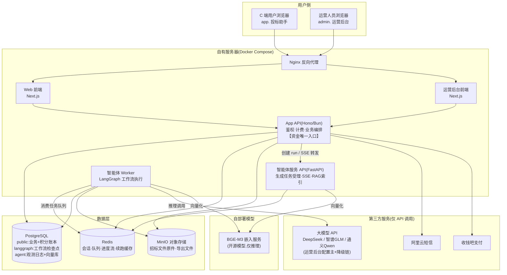

# 系统架构图

> 三层架构,资金与算法严格隔离:所有资金/鉴权在 App API 层;智能体服务只做生成,不接触资金(money-blind)。

## 关键边界

| 边界 | 说明 |
|---|---|
| 资金边界(铁律) | 积分/支付的一切变更只发生在 App API;智能体服务仅上报 token 用量,永不接触资金;每笔扣减/回调带幂等键;余额=append-only 账本求和 |
| 身份边界 | C 端与运营后台独立子域、独立会话体系(C 端 7 天,后台 8 小时) |
| 网络边界 | 智能体服务与嵌入服务不对公网暴露,仅经内部网络访问;对外仅 Nginx 80/443 |
| 数据边界 | 所有向量检索/文档访问按 user_id 强制过滤;跨用户不可见 |
| 模型边界 | 模型型号唯一来源=运营后台配置;未配置 → 拒绝生成(400),不静默回退默认模型 |
