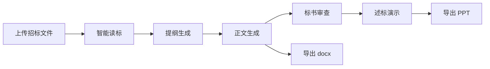
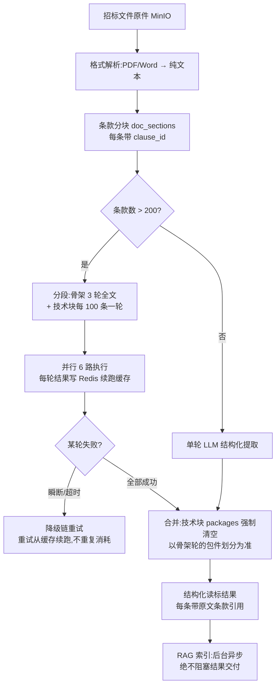
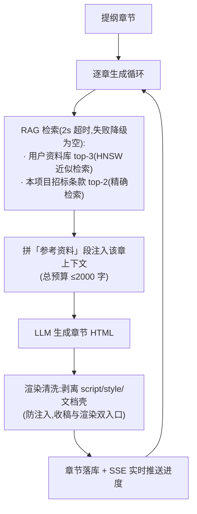
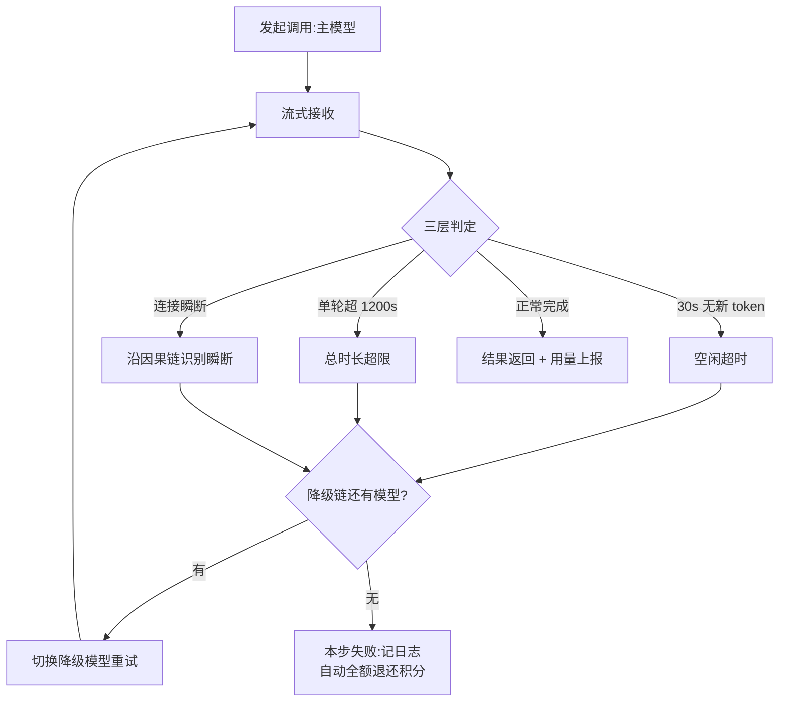

# 算法流程图

> 一个项目 = 一条固定管线;每一步由用户显式点击触发并单独计费(失败自动退款)。步骤间有前置校验(顺序不符返回 409)。

## 总体管线

```mermaid
flowchart LR
    UP[上传招标文件] --> READ[智能读标]
    READ --> OL[提纲生成]
    OL --> CT[正文生成]
    CT --> RV[标书审查]
    RV --> PR[述标演示]
    CT --> EX[导出 docx]
    PR --> EX2[导出 PPT]
```

## 读标(分段并行提取)

```mermaid
flowchart TB
    A[招标文件原件 MinIO] --> B[格式解析:PDF/Word → 纯文本]
    B --> C[条款分块 doc_sections<br/>每条带 clause_id]
    C --> D{条款数 > 200?}
    D -->|否| E[单轮 LLM 结构化提取]
    D -->|是| F[分段:骨架 3 轮全文<br/>+ 技术块每 100 条一轮]
    F --> G[并行 6 路执行<br/>每轮结果写 Redis 续跑缓存]
    G --> H{某轮失败?}
    H -->|瞬断/超时| I[降级链重试<br/>重试从缓存续跑,不重复消耗]
    H -->|全部成功| J[合并:技术块 packages 强制清空<br/>以骨架轮的包件划分为准]
    E --> J
    J --> K[结构化读标结果<br/>每条带原文条款引用]
    K --> L[RAG 索引:后台异步<br/>绝不阻塞结果交付]
```

## 正文生成(含 RAG 检索注入)

```mermaid
flowchart TB
    A[提纲章节] --> B[逐章生成循环]
    B --> C["RAG 检索(2s 超时,失败降级为空):<br/>· 用户资料库 top-3(HNSW 近似检索)<br/>· 本项目招标条款 top-2(精确检索)"]
    C --> D["拼「参考资料」段注入该章上下文<br/>(总预算 ≤2000 字)"]
    D --> E[LLM 生成章节 HTML]
    E --> F["渲染清洗:剥离 script/style/文档壳<br/>(防注入,收稿与渲染双入口)"]
    F --> G[章节落库 + SSE 实时推送进度]
    G --> B
```

## 模型调用韧性(每次 LLM 调用共用)

```mermaid
flowchart TB
    A[发起调用:主模型] --> B[流式接收]
    B --> C{三层判定}
    C -->|30s 无新 token| T1[空闲超时]
    C -->|单轮超 1200s| T2[总时长超限]
    C -->|连接瞬断| T3[沿因果链识别瞬断]
    T1 & T2 & T3 --> D{降级链还有模型?}
    D -->|有| E[切换降级模型重试]
    E --> B
    D -->|无| F[本步失败:记日志<br/>自动全额退还积分]
    C -->|正常完成| G[结果返回 + 用量上报]
```
