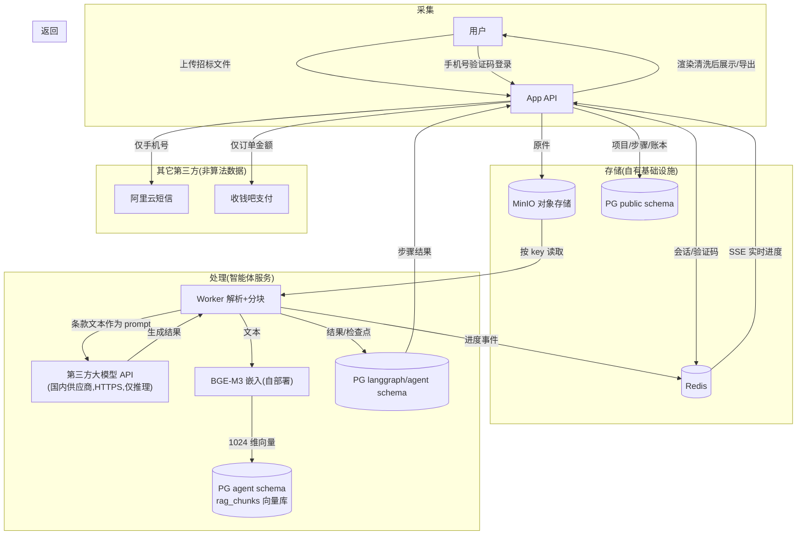

# 数据流向图

> 核心口径:用户文档数据存储在自有基础设施(自有服务器 + 云数据库/对象存储);仅在推理调用时将**文本片段**作为 prompt 发送至国内第三方大模型 API;不用于训练;不出境。

## 数据分类与去向

| 数据 | 存储位置 | 是否离开自有环境 | 保留策略 |
|---|---|---|---|
| 招标文件原件 | MinIO(自有) | 否 | 随项目保留 |
| 条款文本(prompt) | 不落盘,仅推理传输 | **是**——发送至国内第三方大模型 API(HTTPS 加密;供应商承诺不用于训练,见 10 号文档) | 传输即用 |
| 生成结果 | PG(云数据库) | 否 | 随项目保留 |
| 文本向量(rag_chunks) | PG pgvector | 否 | 项目向量 30 天不活跃自动清扫;资料库向量随资料删除 |
| 手机号 | PG + 阿里云短信(发送时) | 发送短信时传递 | 账号存续期 |
| 支付数据 | PG 账本 + 收钱吧 | 订单信息传递 | 永久(账本 append-only) |
| 用户画像/行为数据 | **不采集** | — | — |

## 隔离与最小化

- 智能体服务对用户身份仅持有 `user_id`(数据隔离键),不掌握手机号/资金信息(money-blind)。
- RAG 检索强制 `user_id` + 项目隔离:tender 向量按项目(thread_id)隔离,library 向量按用户隔离,跨用户/跨项目不可检索。
- 技术块读标只发送该块自身条款(不带全文),最小化单次传输内容。
